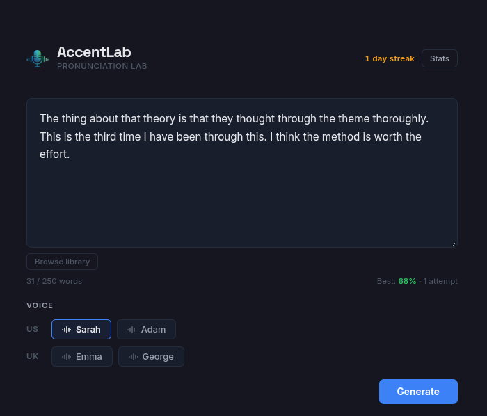
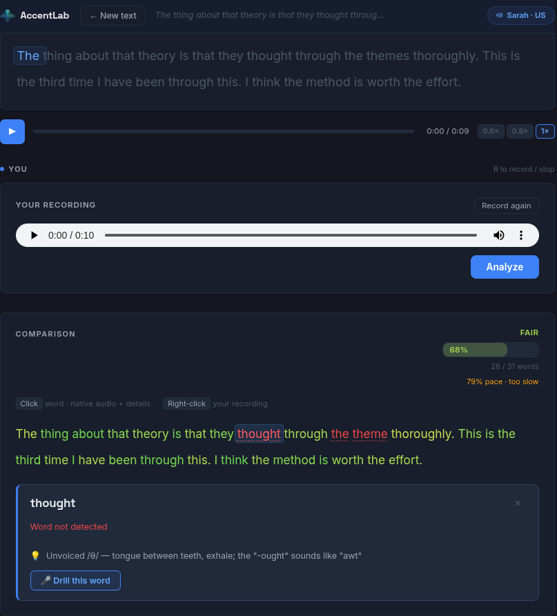
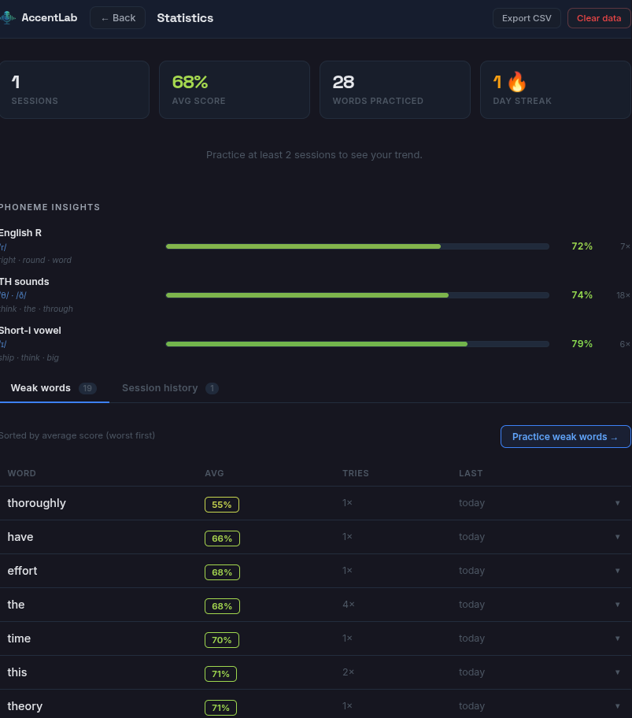

# ShadowCoach

**English pronunciation practice tool** — listen, shadow, and get instant word-by-word feedback. Powered entirely by local AI models. No cloud, no sign-ups, no data leaves your machine.



---

## How it works

1. **Pick a text** — write your own or choose from the built-in library (TH sounds, V & W, short vowels, rhythm, tongue twisters, everyday dialogues…)
2. **Listen** — native TTS audio plays with a karaoke-style word highlighter. Slow it down to 0.6× or 0.8× if needed.
3. **Record** yourself shadowing the audio.
4. **Get scored** word by word — acoustic similarity (MFCC) + intelligibility (Whisper) + rhythm penalty if your pace drifts too far from the native speaker.
5. **Track progress** — streak, average score, weak words, phoneme insights, exportable session history.



---

## Features

- **Kokoro ONNX TTS** with 4 voices (US / UK, male / female)
- **faster-whisper** `small` for word-level alignment and intelligibility scoring
- **Acoustic scoring** via MFCC cosine similarity with CMVN normalization, deltas, and delta-deltas (60-dimensional feature vectors)
- **Rhythm penalty** — speaking too slowly or too fast lowers the score proportionally
- **Slow-motion playback** (0.6×, 0.8×, 1×)
- **Word micro-drill** — re-record a single weak word, compare your recording side by side with the native
- **Per-word tooltip** — score breakdown (acoustic, clarity, combined), pronunciation tips, drill button
- **Pronunciation tips** targeting common errors for Spanish speakers (the most supported pair; the hints are structural and useful for many L1 backgrounds)
- **Curated text library** — TH sounds, V vs W, short vowels (ship/sheep, full/fool), rhythm & linking, reduced auxiliaries, tongue twisters, storytelling
- **IndexedDB history** — personal best per text, streak, weak-word table, phoneme pattern insights
- **Export sessions as CSV**
- **Works offline** after the first model download
- **NVIDIA GPU acceleration** optional (falls back to CPU automatically)



---

## Requirements

- [Docker](https://docs.docker.com/get-docker/) + [Docker Compose](https://docs.docker.com/compose/)
- ~2 GB disk space for ML models (downloaded automatically on first run)
- A microphone

**GPU acceleration (optional):** NVIDIA GPU + [nvidia-container-toolkit](https://docs.nvidia.com/datacenter/cloud-native/container-toolkit/install-guide.html)

---

## Quick start

### CPU — any machine

```bash
docker compose -f docker-compose.cpu.yml up --build
```

### GPU — NVIDIA

```bash
docker compose up --build
```

Then open **http://localhost:5173**

> On first launch the Kokoro ONNX model (~330 MB) and Whisper `small` (~244 MB) are downloaded automatically. Subsequent starts are instant from cached Docker volumes.

### Services

| Service      | URL                          |
|-------------|------------------------------|
| Frontend    | http://localhost:5173        |
| Backend API | http://localhost:8000        |
| API docs    | http://localhost:8000/docs   |

---

## API

| Method | Endpoint    | Description |
|--------|------------|-------------|
| `GET`  | `/health`  | Health check |
| `GET`  | `/voices`  | List available TTS voices |
| `POST` | `/generate` | Generate native audio + word timings from text |
| `POST` | `/analyze` | Score a user recording against native audio |

### `POST /generate`

```json
{ "text": "She sells seashells by the seashore.", "voice": "af_sarah" }
```

Returns the audio URL, word-level timestamps, and durations.

### `POST /analyze`

Multipart form: `audio` (recording), `text` (reference), `native_timings` (JSON from `/generate`), `native_audio_filename`.

Returns per-word scores (acoustic, intelligibility, combined), overall score, and rhythm analysis.

---

## Tech stack

| Layer    | Technology |
|----------|------------|
| Frontend | React 18, Vite, CSS Modules |
| Backend  | FastAPI, Python 3.11 |
| TTS      | [Kokoro ONNX](https://github.com/thewh1teagle/kokoro-onnx) (82M params) |
| STT      | [faster-whisper](https://github.com/SYSTRAN/faster-whisper) `small` |
| Scoring  | MFCC (librosa) + Whisper word probabilities + rhythm penalty |
| Storage  | Browser IndexedDB (no server-side user data stored) |
| Infra    | Docker Compose (CPU + GPU variants) |

---

## Project structure

```
shadow-coach/
├── api/                        # FastAPI backend
│   ├── routers/                # HTTP endpoints (analyze)
│   ├── services/               # TTS, STT, scoring, alignment, cleanup
│   ├── tests/                  # pytest + conftest
│   ├── config.py
│   ├── main.py
│   ├── Dockerfile              # GPU image (nvidia/cuda)
│   ├── Dockerfile.cpu          # CPU image (python:3.11-slim)
│   ├── pyproject.toml          # ruff + mypy config
│   ├── requirements.txt
│   └── requirements-dev.txt
├── web/                        # React frontend
│   └── src/
│       ├── components/         # KaraokePlayer, Recorder, ComparisonView, WordDrill
│       ├── data/               # textLibrary, pronunciationTips
│       ├── hooks/              # useKeyboardShortcuts
│       ├── lib/                # IndexedDB, phonemePatterns, modelLock
│       ├── phases/             # InputPhase, ShadowingPhase, StatsPhase
│       ├── App.jsx
│       └── main.jsx
├── assets/
│   ├── shadow-input-phase.png
│   ├── shadow-shadowing-phase.png
│   └── shadow-stats-phase.png
├── docker-compose.yml          # GPU variant
├── docker-compose.cpu.yml      # CPU variant
├── Makefile                    # dev shortcuts (make up, make test, make lint…)
└── LICENSE
```

---

## Development

Requires Docker running. All commands are run from the repo root.

```bash
make up           # Start with GPU (rebuilds images)
make up-cpu       # Start without GPU
make down         # Stop containers
make logs         # Follow API logs
make shell        # Shell inside API container
make shell-web    # Shell inside web container

make test         # Run all tests (pytest + vitest)
make test-backend # Backend tests only
make test-frontend # Frontend tests only

make lint         # Run all linters (ruff + ESLint)
make lint-fix     # Auto-fix lint issues
make typecheck    # mypy type checking
make security     # bandit security scan

make check        # Full CI pipeline: lint + typecheck + security + tests
make help         # Show all available commands
```

---

## Environment variables

| Variable        | Default | Description |
|----------------|---------|-------------|
| `SHADOW_DEVICE` | `cpu`   | Set to `cuda` for GPU acceleration (auto-set in GPU compose file) |
| `ALLOWED_ORIGINS` | `http://localhost:5173` | Comma-separated CORS origins |

---

## License

[MIT](LICENSE) © 2026 Jesús Gallardo Santos
